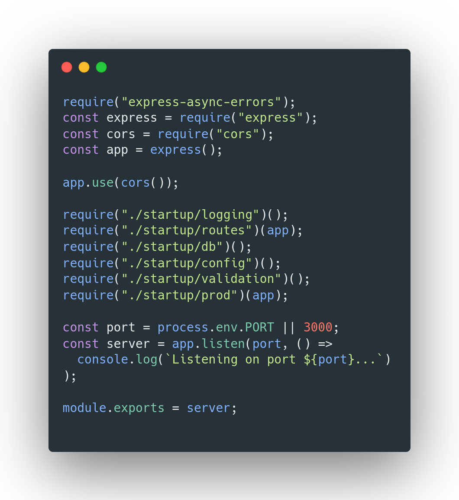

    

    

# About

A complete NodeJs backend for M-Table using ExpressJs and MongoDB, providing API endpoints for all CRUD operations, and an API endpoint for authentication. In this backend, I covered the use of custom middleware, monkey-patching all ExpressJs routes with the help of ExpressJs's error middleware and a library called express-async-errors, and I learned an elegant way to model objects in NodeJs with the help of mongoose.

I also managed to log all handled exceptions in seperate log files, and in a MongoDB collection using winston. Finally I refactored the code to simplify the implementation of each module and avoide mixing interests, **example:**

### Implementation of index.js

---

## Important environment variables

`movies_jwtPrivateKey=<key>`

`movies_db=<PathToDB>`

`PORT=<port>`
